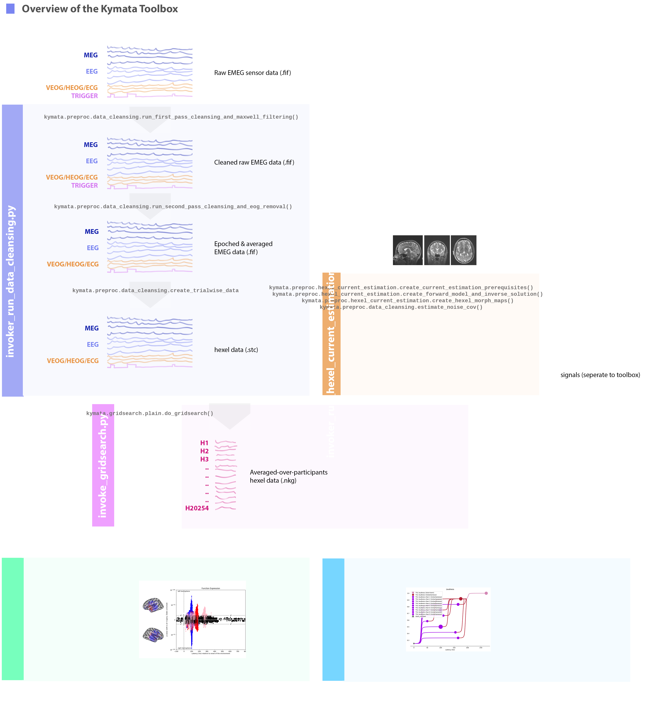

# Kymata Toolbox Readme

[](https://github.com/kymata-atlas/kymata-toolbox/actions/workflows/perform-unit-tests.yml)
[](https://github.com/kymata-atlas/kymata-toolbox/actions/workflows/lint-and-check-formatting.yml)


Maintained by the Kymata Research Group ([kymata.org](https://kymata.org); UCL & University of Cambridge).

//Add citation

## Description

This package forms part of the Kymata Atlas codebase.

//Add pictures

## kymata-preprocessing

The repository holds the Kymata preprocessing code that runs on the MRC-CBU HPC system. This code comprises most of the 'Kymata back-end', including preprocessing steps and statistical procedures. The output of this code is the input to kymata-web.



## Setting up to run with Poetry

First, confirm you have the correct version of Python installed. Navigate to the root directory. Type
```
$ pyenv versions
```
This should confirm that python 3.11 or above is installed. If it isn't already there,
install it using `pyenv install`. You should be able to confirm
you are using the correct version using 

```
python -V
```
To install the python packages you will need to use Poetry. Assuming you have installed [Poetry](https://python-poetry.org/docs/#installing-with-the-official-installer), 
type:
```
$ poetry install
```
to load the pakages needed.

At this point, you should be able to either run the xx from the terminal
```
$ poetry run __init__.py
```
or activate in this environment in an IDE such as PyCharm.

# Run tests

To run the tests, run:
```
$ poetry run pytest
```
