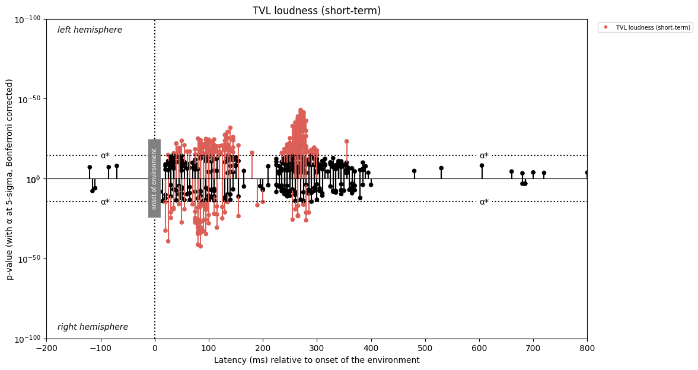
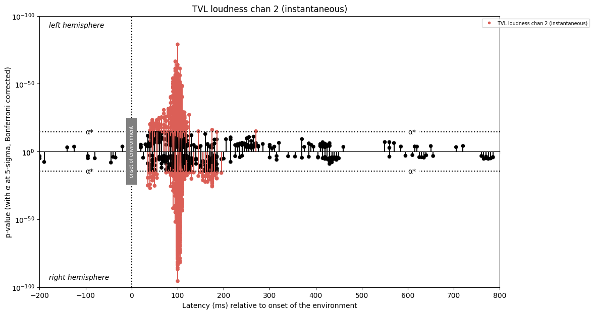
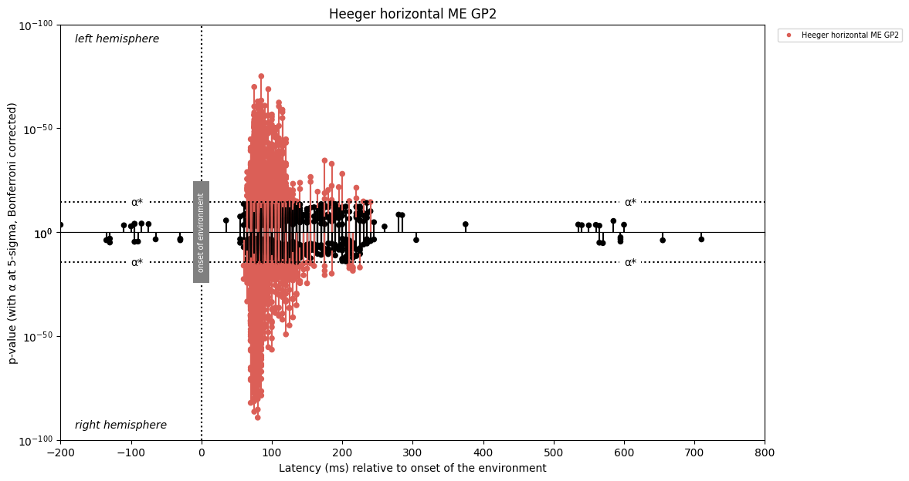

## Hyperparameter Selection and Denoising Experiments for Denoising Strategies

TODO:
- [ ] Push scaler changes
- [ ] Test hyperparameter settings for each system
- [ ] Build automated/manual hyperparameter selector

### Introduction

Our objective in this doc is two-fold:
1) Evaluate various denoising strategies
2) Find heuristics and methods for hyperparameter selection

To evaluate the denoising strategies, we need to identify prototypical clustering problems and examine how each strategy fares. Our experiments will focus on the right hemisphere and the following functions will be investigated.

#### Prototypical Sparse Cluster: TVL loudness (short-term)

#### Prototypical Multiple Peaks Cluster: TVL loudness chan 2 (instantaneous)

#### Prototypical Blurred Cluster: Heeger horizontal ME GP2

### Max Pooling

Try varying the bin size and the significant clusters

### Gaussian Mixture Model

Scaled vs Not scaled (at the end)
BIC vs AIC (BIC is suggested as better for explanatory models)

### DBSCAN

Scaling appears to decrease the performance of DBSCAN. On the x-axis, we have a distance of 5 between successive data points; on the y-axis, the differences are much more minute, ranging from 10^-10 to 10^-100. One can interpret this as the latency dimension having a higher weight than the magnitude dimension. 

Hence, any points on the same x-axis timeframe will be counted in the same radius, which is what we want. 

The performance of DBSCAN depends upon the size of the "thinnest" cluster in the database. In other words, if we can identify the values of minPts and eps that identify the thinnest cluster as significant, we are done. The method to achieve this computes the 4-dist (4th closest point) for every point and plots a 4-dist graph. The graph helps us identify the thinnest cluster by showing where the 4-dist increases substantially, highlighting that these points are sparse. Experiments from [1] show that setting minEps to 4 is optimal since increasing minEps past 4 does not lead to markedly different results but does increase the computational overhead. 

### Mean Shift

Scaled vs Not scaled
estimate bandwidth works fine

### References

[1] - https://www.dbs.ifi.lmu.de/Publikationen/Papers/KDD-96.final.frame.pdf